# UART-BT Converter

A hardware bridge between the UART of a Bafang controller (HIGO 5-pin programming connector) and a phone
over Bluetooth (HM-10 module) - the [EggSPEED](https://github.com/moskil2/EggSPEED) app connects
without a USB OTG cable. In the EggSPEED README this is the "Roadmap" item - **A Bluetooth module replacing the USB OTG cable - 20%**.

This repo exists so that each design session doesn't have to start from scratch - it collects
everything that is settled, confirmed and still open. The full, detailed version of this
documentation: [`research.md`](research.md) (in Polish). The full interactive schematic (with photos attached,
clickable): [`bt-bridge-wiring.html`](bt-bridge-wiring.html).

## HIGO pin numbering - explained 09.09.2026

`Wtyczka_HIGO5.png` (controller side) and `Higo5.PNG` (display side) show different
numbering - but that is not a contradiction, they are two different, mating halves of the same connector,
facing each other "face to face" (hence the naturally reversed position numbering):

| Pin | CONTROLLER side (what we connect to) | DISPLAY side (`Higo5.PNG`, reference only) |
|---|---|---|
| 1 | P+ | GND |
| 2 | PL | TxD |
| 3 | RxD | P+ (36V, 48V, 52V) |
| 4 | GND | RxD |
| 5 | TxD | PL ("Power Lock") |

Only the controller side matters for our BT bridge (1=P+, 2=PL, 3=RxD, 4=GND, 5=TxD).
This numbering comes only indirectly from a forum thread, not from the manufacturer's official schematic -
**despite the explanation above, it is still worth measuring the voltage on each pin of the
physical plug with a multimeter (with the battery connected, the pin at ~30-60V is P+) before soldering anything permanently.**

## Wiring diagram

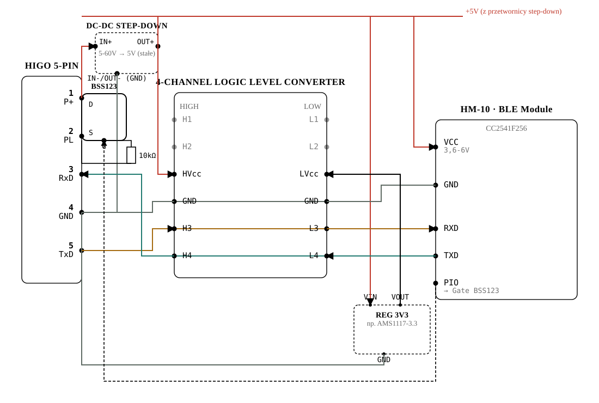 BSS123 MOSFET -> step-down converter -> BSS138 level shifter -> HM-10" width="100%">

Alternative, hybrid diagram (drawn on photos of the real boards):

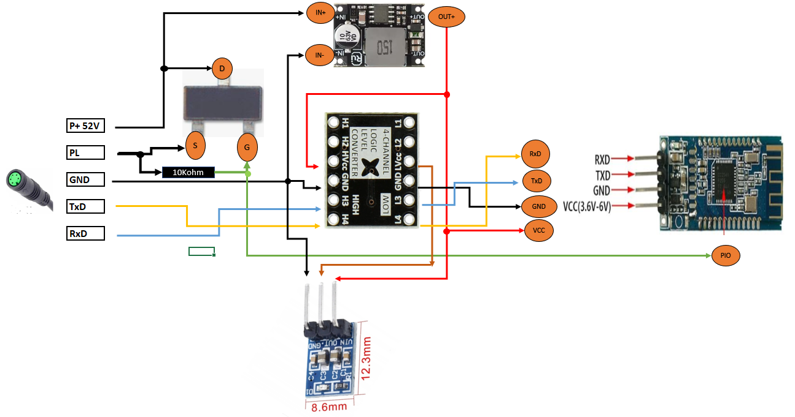

Simplified wiring V2 (3.3 V logic, no level converter, no MOSFET; supersedes the two diagrams above for the simplified build):

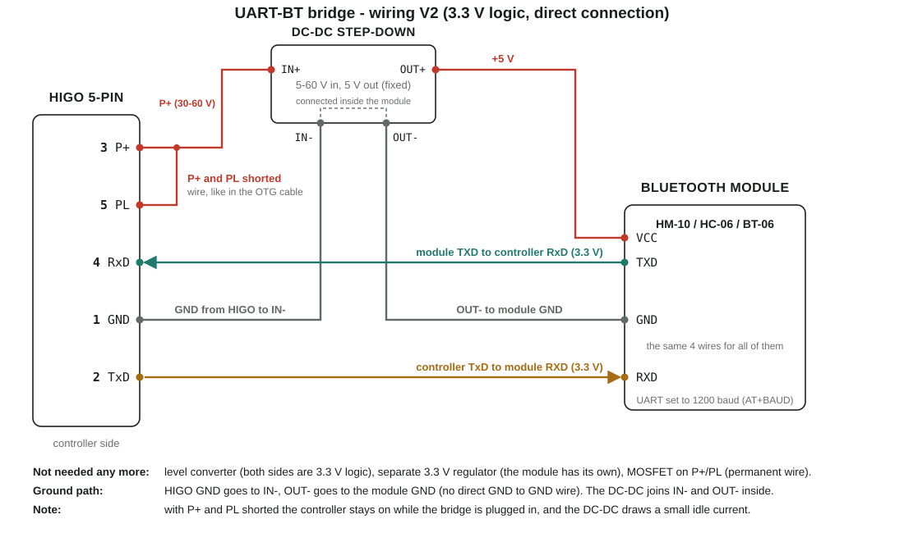

```
P+ (pin1, 30-60V)  -> step-down IN+                          -> BSS123 Drain
step-down OUT+ (+5V) -> level shifter HVcc -> HM-10 module VCC (directly)
                     -> 3.3V regulator VIN (e.g. AMS1117-3.3) -> level shifter LVcc
GND (pin4)          -> common ground (both sides of the circuit, including step-down IN-/OUT-)
TxD (pin5)          -> H3 -> L3 -> RXD (HM-10)
RxD (pin3)          <- H4 <- L4 <- TXD (HM-10)
PL (pin2)           <- BSS123 Source
BSS123 Gate         <- PIO (HM-10), directly (no series resistor)
BSS123 Gate         -> R ~10kΩ -> PL (pull-down, OFF by default - the only resistor in this path)
```

## Components

| Component | Photo | Description |
|---|---|---|
| **HM-10** | 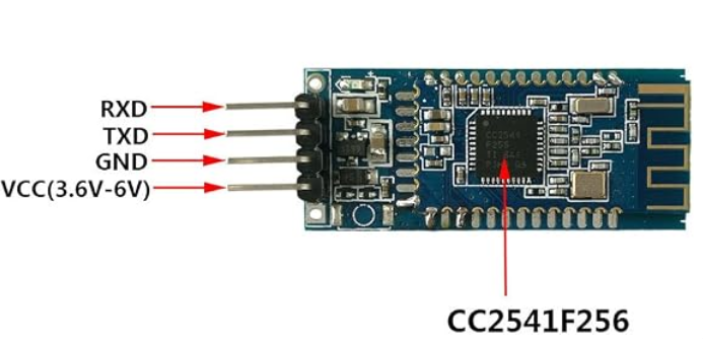 | BLE module, CC2541F256 chip. Pins: RXD, TXD, GND, VCC (3.6-6V), PIO (drives the MOSFET gate). This unit does not expose an internal 3.3V - a separate regulator is needed for the level shifter's LVcc. |
| **Step-down converter P+ → 5V** | 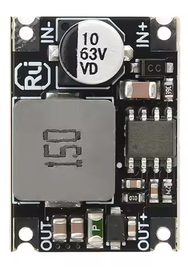 | 5-60V → 5V module, fixed output, 4 pins IN+/IN-/OUT+/OUT-, input capacitor rated 63V. The one and only converter chosen for the project (the earlier XL7015 candidate was rejected). |
| **Logic level shifter** | 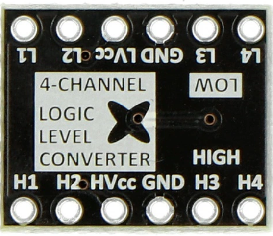 | 4-channel, BSS138-based. Two independent rails: HVcc (5V) and LVcc (3.3V, from a separate regulator, e.g. AMS1117-3.3). |
| **BSS123 MOSFET** | 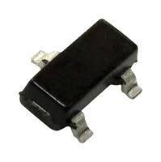 | N-channel, logic-level, SOT-23, 100V/0.17A continuous. Replaces the former fixed wire bridge between P+ and PL - Drain→P+, Source→PL, Gate←PIO (HM-10), **directly, with no series resistor** (that is only an optional good practice, not a requirement - deliberately left out for simplicity). The only resistor in this path is the Gate→PL pull-down (~10kΩ), which keeps the MOSFET OFF by default during HM-10 startup/reset. |
| **3.3V regulator** | 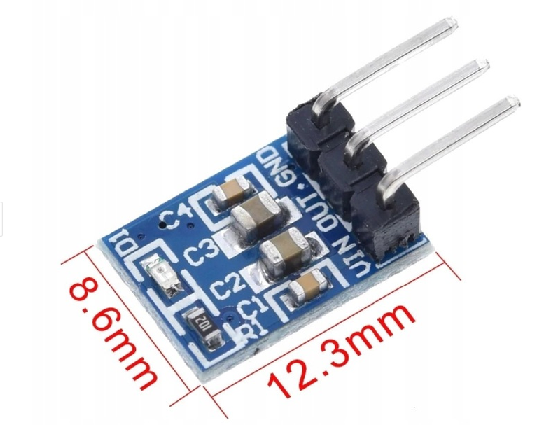 | E.g. AMS1117-3.3, 12.3×8.6mm module, pins VIN/OUT/GND. Powers the level shifter's LVcc (this HM-10 unit does not expose an internal 3.3V). |
| **HIGO 5-pin connector** | 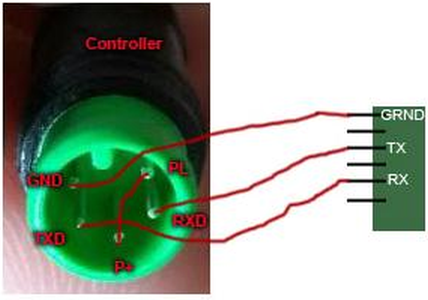 | The controller's programming connector. |
| **HIGO5 reference photo (display side)** | 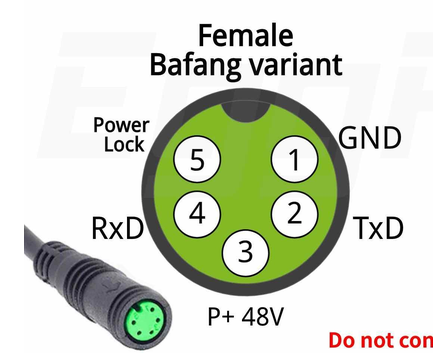 | A different connector, not directly related (the other gender of the plug) - reference only, see the explanation above. |

### Why the BSS123 (100V/0.17A) is enough

Specification of the Bafang DPC18 display
([california-ebike.com](https://california-ebike.com/products/bafang-color-display-dpc18)):
rated current 10mA, max operating current 30mA, standby leakage <1µA, supply to the controller 50mA.
Real currents on the P+/PL line are a few tens of mA - a huge margin against the MOSFET's 170mA.

### Rejected P+/PL switch options

- **NTR4170N** - a mistake from memory, the datasheet showed only 30V - too little, DO NOT USE.
- **Ready-made relay modules "10A 250VAC/10A 30VDC"** - the 30VDC rating is too low (P+ can reach ~58V).
- **Reed relay** - considered, rejected in favor of the MOSFET (smaller, isolation not needed).

## Photos from disassembling the original programming cable

| | |
|---|---|
| 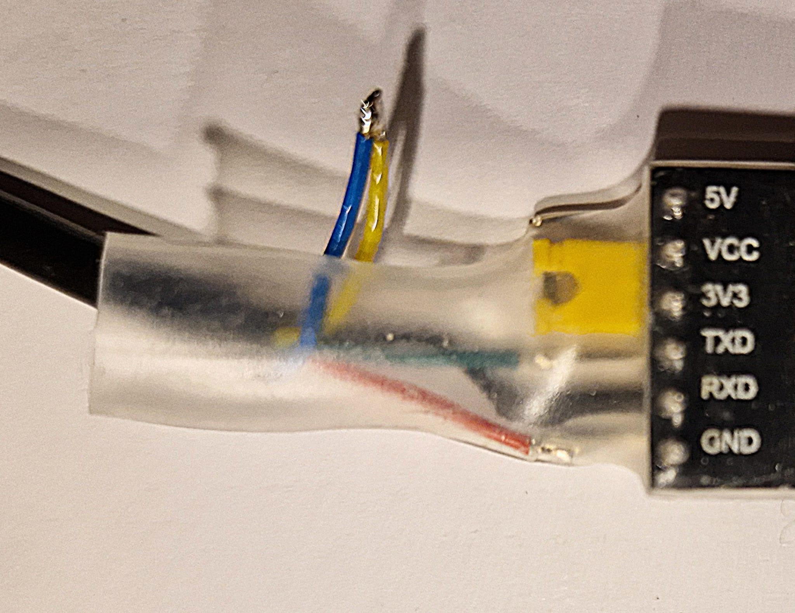 | 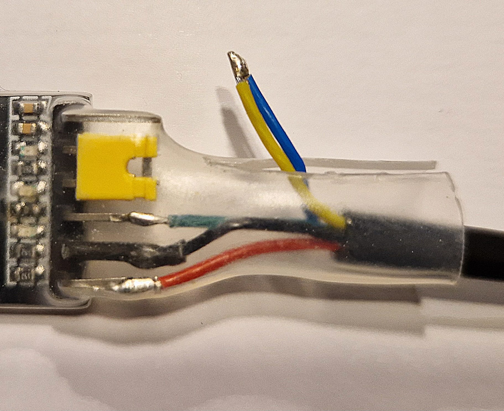 |

They confirm: 3 wires (TXD/RXD/GND) go to the USB-serial board, 2 wires (P+/PL) are
soldered together, separately - this is the mechanism that wakes the controller without a real display.

## To confirm before soldering

- HIGO pin numbering (controller side) - explained, see the section at the top, but still worth verifying with a multimeter (it comes only indirectly from a forum thread).
- The real UART logic level of the controller (3.3V or 5V) - undetermined and deliberately
  left unresolved: the level shifter's HVcc is set to 5V as a safe superset, the BSS138 pulls up
  with a resistor to HVcc, so an active 3.3V driver on the controller side wins anyway - nothing
  gets damaged in either case.

## To do

1. Verify the HIGO pin numbering with a multimeter before soldering.
2. Physically assemble the circuit on a board/prototype - the diagram and component selection are already done,
   what is missing is the actual assembly and a test on a real controller.

## Files in the repo

| File | What it is |
|---|---|
| `research.md` | The full, detailed version of this documentation (in Polish) |
| `bt-bridge-wiring.html` | The full interactive diagram |
| `diagram.svg` | The vector diagram only (no photos), used in this README |
| `HM-10.png`, `HM-10_appka_screenshot.jpg` | Photos of the HM-10 module |
| `KabelUSB_1.jpeg`, `KabelUSB_2.jpeg` | Disassembly of the original programming cable |
| `Konwerter.png` | Logic level shifter (BSS138) |
| `DC-DC_StepDown_DC5-60V_5V.PNG` | The chosen step-down converter |
| `Przetwornica.png` | XL7015 - rejected candidate, archive |
| `BSS_123.jpeg` | BSS123 MOSFET |
| `Wtyczka_HIGO5.png` | HIGO 5-pin connector, controller side |
| `Higo5.PNG` | HIGO 5-pin connector, display side (reference only, a different connector) |
| `Stabilizator.PNG` | 3.3V regulator (e.g. AMS1117-3.3) |
| `Schemat_hybrydowy.png` | Hybrid diagram on photos of the real boards |
| `diagram_v2.svg` | Simplified wiring V2 (3.3 V logic, no level converter, no MOSFET) |
