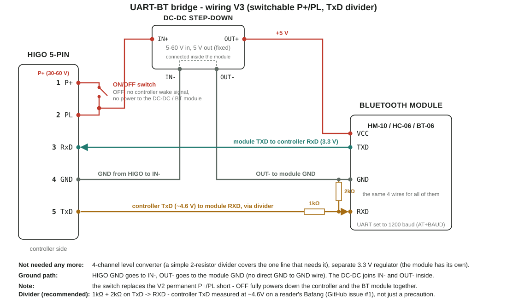
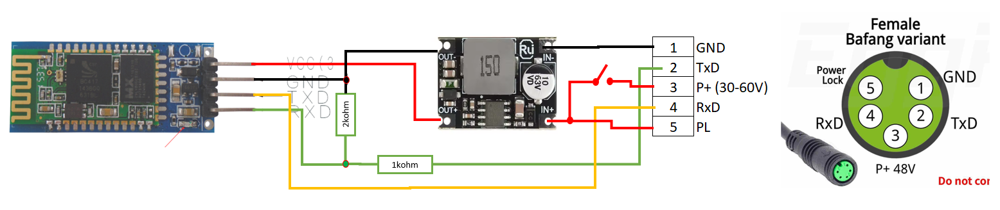
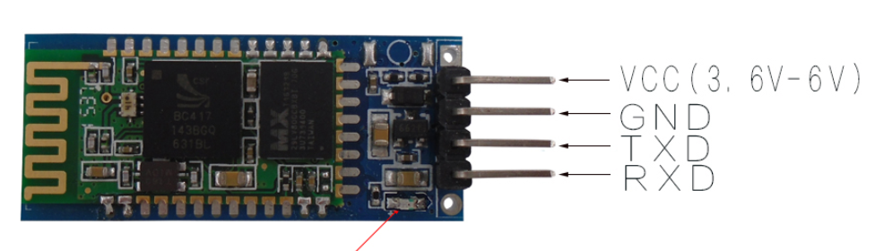

# UART-BT Converter

A hardware bridge between the UART of a Bafang controller (HIGO 5-pin programming connector) and a
phone over Bluetooth, so the [EggSPEED](https://github.com/moskil2/EggSPEED) app connects without a
USB OTG cable.

Two module types are being evaluated, and they are not interchangeable: each speaks a different
Bluetooth protocol, with no shared "Bluetooth" layer underneath, so each needs its own, separate
integration into EggSPEED.

**HC-06** is a classic Bluetooth (Bluetooth Classic, SPP profile) module. It pairs like a wireless
serial cable: Windows and Android see it as a virtual serial port, and once paired it behaves
exactly like the original OTG cable, forcing the controller permanently on for as long as the
module is powered. It has no programmable output pin.

**HM-10** is a Bluetooth Low Energy (BLE) module. Instead of a virtual serial port, an app talks to
it through a GATT service/characteristic, in small packets, which is a different way of exchanging
data on the Android side. Unlike HC-06, HM-10 has a programmable I/O pin (PIO), which makes it
possible to build a remote, software-controlled switch for the controller, instead of forcing it
permanently on.

This repo collects everything that is settled, confirmed and still open in this project. The
full, detailed version of this documentation: [`research.md`](research.md) (in Polish). The full
interactive schematic (with photos attached, clickable): [`bt-bridge-wiring.html`](bt-bridge-wiring.html).

## HIGO pin numbering

The HIGO 5-pin connector, controller side (the one our bridge plugs into):

| Pin | Function |
|---|---|
| 1 | GND |
| 2 | TxD |
| 3 | P+ (30-60V) |
| 4 | RxD |
| 5 | PL ("Power Lock") |

Confirmed against the "Female Bafang variant" pinout chart and the reader's own documentation
(see `Schemat_Hybrydowy_V3.PNG` and GitHub issue #1). An earlier version of this README used a
different numbering (1=P+, 2=PL, 3=RxD, 4=GND, 5=TxD), sourced only indirectly from a forum
thread - that was wrong and has been corrected everywhere in this repo.

`Wtyczka_HIGO5.png` and `Higo5.PNG` show the two different, mating halves of the same connector
(controller side vs. display side) - their printed position numbers look mirrored relative to
each other when just eyeballing the photos, which is what caused the earlier confusion.

**Still worth measuring the voltage on each pin of the physical plug with a multimeter (with the
battery connected, the pin at ~30-60V is P+) before soldering anything permanently.**

## Wiring diagram

Wiring V3 (adds an ON/OFF switch on P+/PL, recommended TxD divider - current preferred variant):



```
P+ (pin3, 30-60V)  -> ON/OFF switch -> PL (pin5)
                                    -> step-down IN+ (tapped on the PL side of the switch)
GND (pin1)          -> step-down IN-
step-down OUT-       -> BT module GND (IN- and OUT- are connected inside the converter -
                        no separate GND to GND wire)
step-down OUT+ (+5V) -> BT module VCC (HM-10 or HC-06/BT-06 - same wiring for both)
TxD (pin2, ~4.6V)   -> [1kΩ series] -> BT module RXD (~3.1V after the divider; see note below)
                       [2kΩ pull-down to GND on the RXD side]
RxD (pin4)          <- BT module TXD (directly, 3.3 V)
```

Switch OFF fully powers down both the controller and the BT module together. The controller's
RxD line (module TXD -> controller RxD) was confirmed at 3.3V from the original programming
cable's wiring. Its TxD line is a separate signal and runs on the controller's own 5V logic rail -
a reader measured it directly with a multimeter at ~4.6V on his Bafang (GitHub issue #1), so the
1kΩ/2kΩ divider on TxD -> RXD is now **recommended**, not just optional, scaling it down to a
safe ~3.1V for the BT module's RXD input. That measurement is from his own controller, not this
repo's - still worth re-checking with a multimeter on any other unit before soldering, since
exact levels can vary a little between controller revisions.

Hybrid diagram V3 (on photos of the real components):



Previous variant (no ON/OFF switch, superseded by V3 above):


```
P+ (pin3, 30-60V)  -> shorted to PL (pin5), like in the original OTG cable
P+ (pin3)          -> step-down IN+
GND (pin1)          -> step-down IN-
step-down OUT-       -> BT module GND (IN- and OUT- are connected inside the converter -
                        no separate GND to GND wire)
step-down OUT+ (+5V) -> BT module VCC (HM-10 or HC-06/BT-06 - same wiring for both)
TxD (pin2)          -> BT module RXD (directly, 3.3 V)
RxD (pin4)          <- BT module TXD (directly, 3.3 V)
```

Previous, more complex version (level shifter, MOSFET-controlled P+/PL switch) - superseded by V2 above, kept here as project history:

 BSS123 MOSFET -> step-down converter -> BSS138 level shifter -> HM-10" width="100%">

Alternative, hybrid diagram of the previous version (drawn on photos of the real boards):


```
P+ (pin1, 30-60V)  -> step-down IN+                          -> BSS123 Drain
step-down OUT+ (+5V) -> level shifter HVcc -> HM-10 module VCC (directly)
                     -> 3.3V regulator VIN (e.g. AMS1117-3.3) -> level shifter LVcc
GND (pin4)          -> common ground (both sides of the circuit, including step-down IN-/OUT-)
TxD (pin5)          -> H3 -> L3 -> RXD (HM-10)
RxD (pin3)          <- H4 <- L4 <- TXD (HM-10)
PL (pin2)           <- BSS123 Source
BSS123 Gate         <- PIO (HM-10), directly (no series resistor)
BSS123 Gate         -> R ~10kΩ -> PL (pull-down, OFF by default - the only resistor in this path)
```

## Components

| Component | Photo | Description |
|---|---|---|
| **HM-10** |  | BLE module, CC2541F256 chip. Pins: RXD, TXD, GND, VCC (3.6-6V), PIO (not used for now - see the wiring diagram above). This unit does not expose an internal 3.3V, but that no longer matters since it is powered directly from the 5V step-down converter. |
| **HC-06 (DSD TECH)** |  | Bluetooth Classic (SPP) module, e.g. DSD TECH's HC-06. Supply 3.6-6V (own onboard regulator), 3.3V communication logic. Default 9600 baud, PIN 1234. AT commands: `AT`, `AT+BAUDx` (1=1200 ... 8=115200), `AT+NAME`, `AT+PIN`, parity - no GPIO/PIO command. |
| **BT-06 (DSD TECH)** | (no photo in this repo) | Same family as HC-06 (BC417 chip), 4 pins only (VCC, GND, TXD, RXD, no LED/KEY), 3.6-6V, "TTL level 3.3V", default 9600 baud, PIN 1234. Harder to find locally than a plain HC-06 - see "To do" below. |
| **Step-down converter P+ → 5V** |  | 5-60V → 5V module, fixed output, 4 pins IN+/IN-/OUT+/OUT-, input capacitor rated 63V. The one and only converter chosen for the project (the earlier XL7015 candidate was rejected). IN- and OUT- are connected inside the module (non-isolated type) - to be verified with a continuity check before building. |
| **HIGO 5-pin connector** |  | The controller's programming connector. |
| **HIGO5 reference photo (display side)** |  | A different connector, not directly related (the other gender of the plug) - reference only, see the explanation above. |

### Previous version: MOSFET-based remote switch (project history, not part of the current build)

| Component | Photo | Description |
|---|---|---|
| **Logic level shifter** |  | 4-channel, BSS138-based. Two independent rails: HVcc (5V) and LVcc (3.3V, from a separate regulator, e.g. AMS1117-3.3). Not needed now that both sides are confirmed to use 3.3V logic. |
| **BSS123 MOSFET** |  | N-channel, logic-level, SOT-23, 100V/0.17A continuous. Was meant to replace the fixed wire bridge between P+ and PL with a remote switch - Drain→P+, Source→PL, Gate←PIO (HM-10), **directly, with no series resistor** (that is only an optional good practice, not a requirement - deliberately left out for simplicity). The only resistor in this path is the Gate→PL pull-down (~10kΩ), which keeps the MOSFET OFF by default during HM-10 startup/reset. Currently P+ and PL are simply shorted with a wire instead, like in the original OTG cable. |
| **3.3V regulator** |  | E.g. AMS1117-3.3, 12.3×8.6mm module, pins VIN/OUT/GND. Was needed to power the level shifter's LVcc. |

#### Why the BSS123 (100V/0.17A) was enough

Specification of the Bafang DPC18 display
([california-ebike.com](https://california-ebike.com/products/bafang-color-display-dpc18)):
rated current 10mA, max operating current 30mA, standby leakage <1µA, supply to the controller 50mA.
Real currents on the P+/PL line are a few tens of mA - a huge margin against the MOSFET's 170mA.

#### Rejected P+/PL switch options

- **NTR4170N** - a mistake from memory, the datasheet showed only 30V - too little, DO NOT USE.
- **Ready-made relay modules "10A 250VAC/10A 30VDC"** - the 30VDC rating is too low (P+ can reach ~58V).
- **Reed relay** - considered, rejected in favor of the MOSFET (smaller, isolation not needed).

## Photos from disassembling the original programming cable

| | |
|---|---|
|  |  |

They confirm: 3 wires (TXD/RXD/GND) go to the USB-serial board, 2 wires (P+/PL) are
soldered together, separately - this is the mechanism that wakes the controller without a real display.

## To confirm before soldering

- HIGO pin numbering (controller side) - explained, see the section at the top, but still worth verifying with a multimeter (it comes only indirectly from a forum thread).
- The controller's RxD line is settled at 3.3V (confirmed by the original programming cable,
  which talks to the controller on 3.3V logic - see "Photos from disassembling the original
  programming cable" below). Its TxD line runs on the controller's own 5V logic rail - a reader
  measured it directly at ~4.6V (GitHub issue #1) - which is why the V3 wiring includes a
  1kΩ/2kΩ divider on that line, recommended rather than a full level converter.
- Set the BT module to 1200 baud via AT commands (`AT+BAUD1` for HC-06/BT-06) before soldering -
  needs a 3.3V USB-UART adapter, module unpaired, no line ending.
- Change the module's default pairing PIN (`AT+PIN`) - the default 1234/000000 would let anyone
  nearby pair and write to the controller.
- If buying a generic HC-06 clone, test each unit before soldering: `AT` -> `OK`,
  `AT+VERSION`, `AT+BAUD1` -> `OK1200`.

## To do

1. Verify the HIGO pin numbering with a multimeter before soldering.
2. Buy an HC-06 module (locally, e.g. Allegro - AliExpress import fees currently make it not
   worth it for a single unit) and test it with AT commands.
3. Set the module to 1200 baud.
4. Physically assemble the simplified circuit (diagram V2 above) on a board/prototype.
5. Test on a real controller - **OEM Bafang first** (the large majority of EggSPEED users),
   then bbs-fw: read/telemetry first, writes after.

## Files in the repo

| File | What it is |
|---|---|
| `research.md` | The full, detailed version of this documentation (in Polish) |
| `bt-bridge-wiring.html` | The full interactive diagram |
| `diagram.svg` | The vector diagram of the previous, more complex version (superseded by `diagram_v2.svg`) |
| `HM-10.png`, `HM-10_appka_screenshot.jpg` | Photos of the HM-10 module |
| `KabelUSB_1.jpeg`, `KabelUSB_2.jpeg` | Disassembly of the original programming cable |
| `Konwerter.png` | Logic level shifter (BSS138) |
| `DC-DC_StepDown_DC5-60V_5V.PNG` | The chosen step-down converter |
| `Przetwornica.png` | XL7015 - rejected candidate, archive |
| `BSS_123.jpeg` | BSS123 MOSFET |
| `Wtyczka_HIGO5.png` | HIGO 5-pin connector, controller side |
| `Higo5.PNG` | HIGO 5-pin connector, display side (reference only, a different connector) |
| `Stabilizator.PNG` | 3.3V regulator (e.g. AMS1117-3.3) |
| `Schemat_hybrydowy.png` | Hybrid diagram on photos of the real boards |
| `diagram_v2.svg` | Simplified wiring V2 (3.3 V logic, no level converter, no MOSFET, no switch) |
| `diagram_v3.svg` | Wiring V3 - adds an ON/OFF switch on P+/PL and an optional TxD divider (current preferred variant) |
| `HC-06.PNG` | Photo of the HC-06 module with pinout (VCC, GND, TXD, RXD) |
| `Schemat_Hybrydowy_V3.PNG` | Hybrid diagram V3, on photos of the real components (HC-06, step-down converter, switch, connector) |
